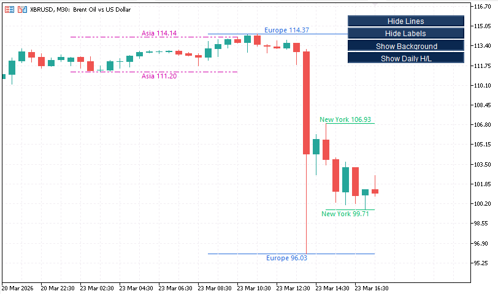

# FxTT MT5 Session High/Low – Free Indicator


> A free, open-source MT5 indicator that draws the high and low of the Asia, Europe, and New York trading sessions — with background shading, price labels, daily H/L lines, and one-click toggle buttons — directly on your chart.



---

## 📌 Overview

The **FxTT MT5 Session High/Low** indicator marks the high and low price reached during each major forex trading session: Asia, Europe, and New York. It supports multiple historical lookback periods so you can see where price traded relative to recent session ranges at a glance.

Session highs and lows are among the most reliable areas of support and resistance in the forex market. Institutional order flow concentrates around these levels, making them essential reference points for breakout, pullback, and range-trading strategies.

**Product page & documentation:** [forextradingtools.eu](https://forextradingtools.eu)

---

## ✨ Features

- **Three sessions** — Asia, Europe, and New York, each independently configurable
- **Background shading** — color-coded session backgrounds for instant visual orientation
- **Price labels** — optional labels showing the exact high and low price for each session
- **Daily High/Low** — optional overlay of the current and previous day's high and low lines
- **Historical lookback** — display up to N previous sessions on the chart (default 5)
- **GMT offset support** — configure your broker's server time offset to align sessions accurately
- **Toggle buttons** — one-click panel to show/hide lines, labels, background, and daily H/L without reopening settings
- **Extend current lines** — optionally extend the active session's high/low lines to the right edge of the chart
- **Customizable colors and line styles** — per-session color, line style, and line width controls
- **Lightweight** — object-based drawing with minimal CPU footprint, suitable for VPS use

---

## 🕐 Session Times (GMT)

| Session | Default Start | Default End |
|---------|--------------|-------------|
| **Asia** | 00:00 | 09:00 |
| **Europe** | 07:00 | 16:00 |
| **New York** | 13:00 | 22:00 |

> All times are in GMT. Use the **GMT Offset** input to match your broker's server time (e.g. set `+2` for a broker running on GMT+2).

---

## 🖥️ Platform Requirements

- **Platform:** MetaTrader 5 (MT5)
- **File type:** `.ex5` (compiled) / `.mq5` (source)
- **Version:** 2.20 (March 2026)
- **Instruments:** Forex, gold, indices, crypto, and all MT5-supported symbols

---

## 🚀 Installation

1. Download `fxtt-session-high-low.ex5` from the [Releases](../../releases) page
   *(or compile `fxtt-session-high-low.mq5` yourself in the MetaEditor)*
2. Open MT5 → **File → Open Data Folder**
3. Navigate to `MQL5/Indicators/`
4. Copy `fxtt-session-high-low.ex5` into that folder
5. Restart MT5 (or right-click the Navigator panel → **Refresh**)
6. Find **fxtt-session-high-low** under **Navigator → Indicators**
7. Drag it onto any chart — session levels will appear immediately
8. Configure the sessions, GMT offset, and display settings in the Inputs tab

---

## ⚙️ Settings Reference

### General

| Parameter | Default | Description |
|-----------|---------|-------------|
| `Lookback` | 5 | Number of historical session occurrences to display |
| `GMT Offset` | +2 | Broker server time offset from GMT |

### Asia Session

| Parameter | Default | Description |
|-----------|---------|-------------|
| `Show Asia` | true | Show or hide the Asia session |
| `Asia Start (GMT)` | 0 | Session start hour in GMT |
| `Asia End (GMT)` | 9 | Session end hour in GMT |
| `Asia High Color` | Purple | Color of the Asia session high line |
| `Asia Low Color` | Purple | Color of the Asia session low line |
| `Asia Background Color` | — | Background shading color for the Asia session |
| `Asia Line Style` | Dash-Dot-Dot | Line style for historical session lines |
| `Asia Line Width` | 1 | Line width |

### Europe Session

| Parameter | Default | Description |
|-----------|---------|-------------|
| `Show Europe` | true | Show or hide the Europe session |
| `Europe Start (GMT)` | 7 | Session start hour in GMT |
| `Europe End (GMT)` | 16 | Session end hour in GMT |
| `Europe High Color` | Blue | Color of the Europe session high line |
| `Europe Low Color` | Blue | Color of the Europe session low line |
| `Europe Background Color` | — | Background shading color for the Europe session |
| `Europe Line Style` | Dash-Dot-Dot | Line style for historical session lines |
| `Europe Line Width` | 1 | Line width |

### New York Session

| Parameter | Default | Description |
|-----------|---------|-------------|
| `Show New York` | true | Show or hide the New York session |
| `New York Start (GMT)` | 13 | Session start hour in GMT |
| `New York End (GMT)` | 22 | Session end hour in GMT |
| `New York High Color` | Green | Color of the New York session high line |
| `New York Low Color` | Green | Color of the New York session low line |
| `New York Background Color` | — | Background shading color for the New York session |
| `New York Line Style` | Dash-Dot-Dot | Line style for historical session lines |
| `New York Line Width` | 1 | Line width |

### Daily High/Low

| Parameter | Default | Description |
|-----------|---------|-------------|
| `Show Daily H/L` | true | Show or hide daily high and low lines |
| `Daily High Color` | Gold | Color of the daily high line |
| `Daily Low Color` | Gold | Color of the daily low line |
| `Daily Line Style` | Dashed | Line style for daily H/L lines |
| `Daily Line Width` | 1 | Line width |

### Lines & Labels

| Parameter | Default | Description |
|-----------|---------|-------------|
| `Extend Current Lines` | false | Extend the active session's lines to the right edge of the chart |
| `Label Font` | Segoe UI | Font used for price labels |
| `Label Font Size` | 8 | Font size for price labels |

### Button Panel

| Parameter | Default | Description |
|-----------|---------|-------------|
| `Show Panel` | true | Show or hide the toggle button panel |
| `Button Text Color` | White | Color of the button text |
| `Button Background Color` | Dark blue | Background color of the buttons |
| `Panel X Offset` | — | Horizontal offset of the panel from the chart corner |
| `Panel Y Offset` | — | Vertical offset of the panel from the chart corner |
| `Panel Corner` | Top-Right | Chart corner where the panel is anchored |

---

## 🔘 Toggle Buttons

The indicator includes a compact on-chart button panel for quick control without reopening the settings dialog.

| Button | Function |
|--------|----------|
| **Show / Hide Lines** | Toggle session high and low lines on/off |
| **Show / Hide Labels** | Toggle price labels on/off |
| **Show / Hide Background** | Toggle background session shading on/off |
| **Show / Hide Daily H/L** | Toggle the daily high and low lines on/off |

---

## 💡 How to Use It

1. **Trade session breakouts** — when price breaks above the Asia session high during the Europe session, it often signals a directional move; use the broken level as a re-entry or stop reference
2. **Identify session overlap opportunities** — the Europe/New York overlap (13:00–16:00 GMT) is the highest-volume period; session high/low breaks during this window carry greater weight
3. **Use historical levels as support and resistance** — yesterday's session highs and lows frequently act as intraday S/R for the current day
4. **Confirm range-bound conditions** — if price respects both the session high and low over multiple periods, consider a range-trading strategy between them
5. **Combine with the Daily H/L** — when a session high aligns with the daily high, it creates a stronger resistance confluence
6. **Set stops beyond session extremes** — session highs and lows are natural stop placement levels for breakout entries

---

## 🗂️ Repository Structure

```
fxtt-mt5-session-high-low/
├── src/
│   └── fxtt-session-high-low.mq5        # Full MQL5 source code
├── releases/
│   └── fxtt-session-high-low.ex5        # Compiled MT5 binary (ready to install)
├── screenshots/
│   ├── session-high-low-chart.png        # Indicator on MT5 chart
│   └── session-high-low-settings.png     # Settings panel
└── README.md
```

---

## 📝 Changelog

### v2.20 — March 2026
- Added toggle button panel for one-click show/hide of lines, labels, background, and daily H/L
- Added Daily High/Low overlay

### v2.10 — March 2026
- Improved session detection with midnight wrap-around handling
- Added GMT offset input for broker server time alignment

### v2.00 — March 2026
- Full rewrite with background shading and price labels
- Per-session color, line style, and line width controls

### v1.00 — March 2026
- Initial release
- Asia, Europe, and New York session high/low lines with lookback support

---

## 🤝 Contributing

Contributions are welcome. If you find a bug or want to propose an improvement:

1. Fork this repository
2. Create a feature branch (`git checkout -b feature/my-improvement`)
3. Commit your changes (`git commit -m 'Add my improvement'`)
4. Push to the branch (`git push origin feature/my-improvement`)
5. Open a Pull Request

For significant changes, please open an issue first to discuss what you'd like to change.

---

## ❓ FAQ

**Is this indicator free?**
Yes, completely free to download and use.

**Which session times should I use?**
The defaults (Asia 00–09, Europe 07–16, New York 13–22 GMT) cover the three major forex sessions. Adjust the GMT offset to match your broker's server time so the lines land on the correct candles.

**Can I use it on any timeframe?**
Yes. The indicator works on all chart timeframes and automatically adjusts the session detection accordingly.

**Does it repaint?**
No. Session highs and lows are tracked in real time during the session and remain fixed once the session closes.

**Can I use it alongside Expert Advisors?**
Yes. The indicator is display-only and does not send orders or interfere with EAs.

**The session lines are shifted — what should I do?**
Check your broker's server time (visible in the MT5 bottom bar) and set the `GMT Offset` input to the correct value. For example, if broker time shows GMT+3, set the offset to `+3`.

---

## 📄 License

This project is licensed under the **MIT License** — you are free to use, modify, and distribute this code, provided the original copyright notice is retained.

See [LICENSE](./LICENSE) for details.

---

## 🔗 More Free Tools

All free indicators and EAs from Forex Trading Tools:

- 🔗 [FxTT MT5 Pivot Points – Free MT5 Indicator](https://github.com/ForexTradingTools/fxtt-mt5-pivot-points)
- 🔗 [FxTT MT5 Forex Scanner – Free MT5 Indicator](https://forextradingtools.eu/products/indicators/mt5-forex-scanner-free/)
- 🔗 [FxTT Multi-purpose Forex Scanner – Free MT4 Indicator](https://forextradingtools.eu/products/indicators/forex-scanner-free/)
- 🔗 [Strategy Checklist – Free MT4 Indicator](https://forextradingtools.eu/products/indicators/strategy-checklist-free-indicator/)
- 🔗 [MTF Triple Moving Averages – Free MT4 Indicator](https://forextradingtools.eu/products/indicators/mtf-triple-moving-averages-free-indicator/)
- 🔗 [MTF Bollinger Bands – Free MT5 Indicator](https://forextradingtools.eu/products/indicators/mtf-bollinger-bands-mt5-indicator/)

---

*Made with ❤️ by [Carlos Oliveira](https://forextradingtools.eu) | Forex Trading Tools*
